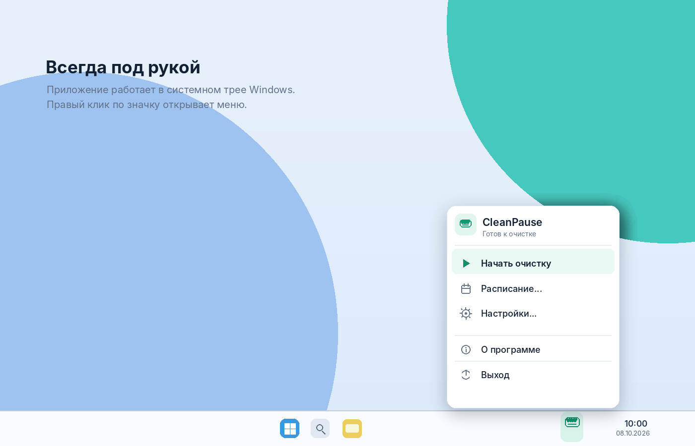
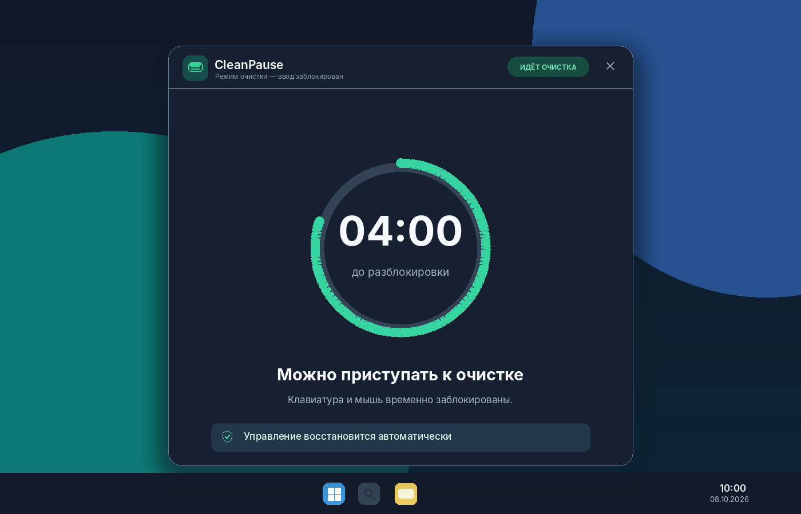
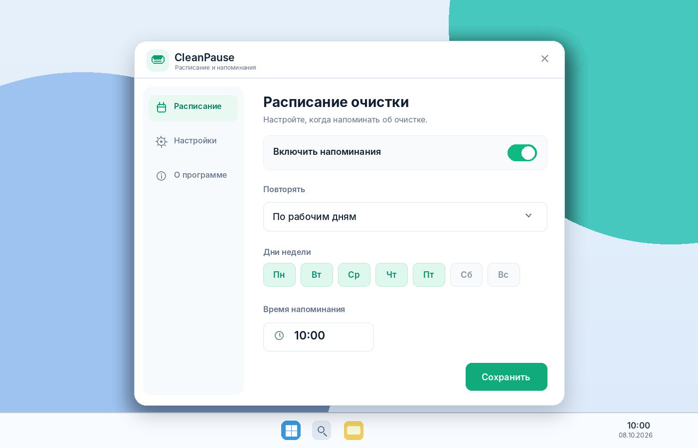
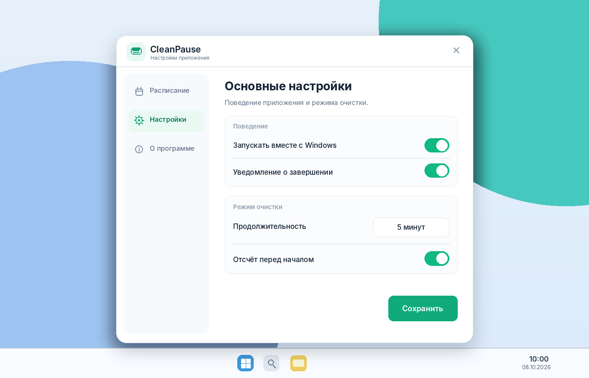

# CleanPause — техническое задание на разработку

**Версия документа:** 1.0  
**Дата:** 08.10.2026  
**Рабочее название продукта:** CleanPause  
**Платформа:** Microsoft Windows 10/11 (x64)  
**Язык реализации:** Go (Golang)  
**Тип продукта:** локальное настольное приложение с постоянной работой в системном трее  
**Релиз:** MVP 1.0

> **Цель:** дать пользователю возможность протирать клавиатуру и мышь влажной салфеткой, не вызывая случайных нажатий или кликов, и регулярно напоминать о необходимости чистки.

## 1. Состав поставки

- `CleanPause.exe` — основной исполняемый файл, включающий GUI и режим управляющего процесса блокировки (или отдельный worker, если это обосновано реализацией).
- Исходный код проекта на Go, `go.mod`, инструкция по сборке.
- Иконка программы и ресурсы локализации.
- `README.md` — пользовательская документация и описание аварийного восстановления ввода.
- Опциональный установщик `CleanPause-Setup.exe`.
- Автоматизированные тесты алгоритма расписаний и состояний; протокол ручных испытаний на Windows 10/11.

В этой папке также предоставлены согласованные **концептуальные макеты** интерфейса в JPEG. Макеты не являются скриншотами уже разработанного приложения.

## 2. Основная логика приложения

Приложение постоянно работает в области уведомлений Windows (tray) и не показывает главное окно при обычном запуске. Пользователь может:

1. Начать очистку вручную через меню трея или двойной щелчок по значку.
2. Настроить напоминания по времени и дням недели.
3. При напоминании нажать **«Начать очистку»** либо **«Отложить»**.
4. После подтверждения дождаться 3-секундного подготовительного отсчёта.
5. На 5 минут заблокировать обычный ввод с клавиатуры и мыши средствами Windows.
6. По окончании получить автоматически восстановленный ввод и уведомление.

**Запрещено автоматически запускать блокировку по расписанию без явного подтверждения пользователя.**

## 3. Системный трей



### 3.1. Меню по правому щелчку

- **Начать очистку** — открыть окно подготовки.
- **Расписание…** — открыть управление напоминаниями.
- **Настройки…** — открыть настройки.
- **О программе** — версия приложения, автор и лицензия.
- **Выход** — корректно завершить приложение.

### 3.2. Поведение

- Двойной щелчок левой кнопкой по иконке: окно подготовки к очистке.
- В обычном состоянии tooltip: `CleanPause — защита клавиатуры и мыши`.
- При активной очистке значок меняет вид; после разблокировки возвращается в исходное состояние.
- Только **один экземпляр** приложения на интерактивную сессию Windows. Повторный запуск активирует уже открытое приложение или завершает второй процесс.
- Закрытие окна настроек или напоминания **не** завершает фоновое приложение.
- Пункт «Выход» недоступен во время блокировки, поскольку ввод временно не принимается. По завершении таймера доступен снова.

## 4. Окно напоминания


### 4.1. Содержание

- Заголовок: **«Время почистить устройства!»**.
- Пояснение: **«Протрите клавиатуру и мышь без случайных нажатий клавиш и кликов.»**
- Указание времени очистки: **5 минут** (или длительность, выбранная пользователем).
- Основная крупная кнопка: **«Начать очистку»**.
- Выпадающий список и кнопка **«Отложить»**.

### 4.2. Варианты откладывания

| Значение | Интервал |
|---|---|
| По умолчанию | 15 минут |
| Вариант 2 | 1 час |
| Вариант 3 | 2 часа |
| Вариант 4 | 3 часа |
| Вариант 5 | На следующий день |

Перенос затрагивает только **текущее напоминание**, а не базовое регулярное расписание.

### 4.3. Поведение

- В обычном режиме окно отображается поверх стандартных окон, но не принуждает сворачивать приложения.
- В полноэкранном приложении допускается уведомление Windows вместо принудительного переключения фокуса. Пользователь открывает окно самостоятельно.
- Закрытие крестиком эквивалентно переносу на **15 минут**, если пользователь не выбрал другое время.
- Запрещено показывать несколько копий окна напоминания одновременно.
- Ввод блокируется **только** после нажатия кнопки «Начать очистку» и завершения подготовительного отсчёта.

## 5. Режим очистки



### 5.1. Запуск

1. Пользователь нажимает «Начать очистку».
2. Приложение проверяет, что блокировка доступна в текущем интерактивном сеансе.
3. Отображается предупреждение: клавиатура и мышь временно перестанут реагировать, `Ctrl+Alt+Del` используется для аварийного восстановления.
4. Запускается подготовительный отсчёт: **3… 2… 1…**.
5. Приложение вызывает системную функцию блокировки ввода.
6. **Только при успешном выполнении блокировки** запускается рабочий пятиминутный таймер.
7. На экране отображается оставшееся время.
8. При завершении периода приложение восстанавливает ввод, фиксирует результат и уведомляет пользователя.

Если блокировка не удалась, программа показывает ошибку и **не** делает вид, что устройства заблокированы.

### 5.2. Таймер

- Стандартная длительность: **300 секунд**.
- Настраиваемая длительность: **1–15 минут**.
- Частота перерисовки цифрового таймера: приблизительно раз в секунду.
- Для расчёта интервала использовать монотонное время, а не зависеть от изменений системных часов.
- Не увеличивать блокировку произвольно после пробуждения ПК либо системного изменения времени.
- При наличии проблем с отрисовкой UI блокировка всё равно обязана завершаться по независимому таймеру управляющего механизма.

### 5.3. Что требуется блокировать

- Стандартные нажатия физической клавиатуры.
- Обычные нажатия кнопок мыши, движение мыши и прокрутку колеса.
- Ввод от нескольких обычных HID-клавиатур/мышей, проходящий через блокируемый системный механизм Windows.

**Ограничение:** утилита не является драйвером HID и не обещает отключение устройств на аппаратном уровне. Специализированные устройства, удалённый ввод, экранная клавиатура, программная инъекция и отдельные защищённые интерфейсы Windows могут вести себя иначе. Проверять фактическое поведение, не заявлять абсолютную блокировку всех каналов ввода.

## 6. Безопасность блокировки и восстановление ввода

Это **приоритет № 1** при разработке. Основной механизм для прототипа: Windows API [`BlockInput`](https://learn.microsoft.com/en-us/windows/win32/api/winuser/nf-winuser-blockinput) из `user32.dll`.

### 6.1. Потоковая модель

- Все операции `BlockInput(TRUE)` и `BlockInput(FALSE)` должны выполняться одним и тем же **OS-потоком**, который установил блокировку.
- Использовать `runtime.LockOSThread()` в Go, чтобы горутина не была перенесена на другой системный поток.
- Блокирующий механизм отделить от GUI и приложения-трея; рекомендуемый вариант — отдельный worker-процесс, запущенный этим же EXE с аргументом `--input-worker`.
- GUI и планировщик продолжают исполняться независимо от worker и его таймера.

### 6.2. Watchdog

- Основное приложение следит за worker через локальный IPC (например, Windows Named Pipe) и состояние процесса.
- Worker сообщает о запуске, успешной блокировке, истечении таймера и разблокировке.
- Watchdog фиксирует отсутствие heartbeat и зависание процесса.
- Если невозможно корректно попросить worker завершить блокировку, допускается **завершить worker-процесс**, после чего Windows должна восстановить блокированный ввод согласно предусмотренному поведению API.
- Watchdog **не должен** пытаться снимать блокировку вызовом `BlockInput(FALSE)` из другого потока: такой вызов не гарантирует результат.
- Реализацию проверить экспериментально на Windows 10/11.

### 6.3. Аварийный выход

До запуска очистки показать пользователю подсказку:

> Если управление не восстановилось, нажмите **Ctrl+Alt+Del**. Windows снимает блокировку ввода через системную последовательность безопасности.

Не обещать сочетания `Esc`, `Ctrl+Shift+Esc` или «клик по кнопке Отмена» во время активной блокировки: приложение не обязано получать эти события, пока Windows блокирует ввод.

### 6.4. Требования к отказоустойчивости

- Если worker аварийно завершился, окно очистки закрывается или переходит в состояние ошибки, но пользовательский ввод не должен оставаться заблокированным.
- Если GUI завис или завершился, независимый таймер worker восстанавливает ввод по окончании установленного периода.
- Повторный запуск блока во время действующей блокировки недопустим.
- При ошибках IPC не продлевать время блокировки.
- При сбое API или невозможности безопасного запуска пользователь получает объяснение, а блокировка не начинается.

## 7. Расписание напоминаний



### 7.1. Варианты расписания

- Каждый день.
- По рабочим дням: понедельник–пятница.
- Произвольный набор дней недели.
- Произвольное время в формате `ЧЧ:ММ` (местное время Windows).
- Включение/отключение расписания.

**MVP поддерживает одно расписание.** Модель данных и интерфейсы планировщика спроектировать так, чтобы в дальнейшем добавить несколько расписаний.

### 7.2. Расчёт времени

- Для следующего напоминания вычисляется ближайшая подходящая дата и время.
- После переноса на 15 минут/1/2/3 часа рассчитывается конкретная временная точка `snoozed_until`, сохранённая в настройках.
- «Следующий день» означает ближайшее следующее допустимое срабатывание регулярного расписания **после текущего дня**. Например, для рабочих дней перенос в пятницу означает понедельник.
- После выхода из сна Windows просроченное напоминание показывается один раз, без множества всплывающих окон.
- Перезагрузка компьютера не отменяет актуальный перенос напоминания.
- Корректно обрабатывать изменение часового пояса и переход на летнее/зимнее время: не создавать повторные уведомления на одну запланированную сессию.
- В момент активной очистки новые плановые напоминания не показываются; конкурирующие события объединяются в одно либо отмечаются выполненными согласно правилам состояния.

### 7.3. Внутренняя реализация

Собственный планировщик Go с ожиданием ближайшего события. Не требуется создавать отдельную задачу в Windows Task Scheduler. Подписаться на системные события выхода из сна/изменения времени или периодически безопасно пересчитывать ближайшее расписание.

## 8. Настройки



| Параметр | Значение по умолчанию |
|---|---|
| Запуск вместе с Windows | Включён |
| Напоминания | Включены |
| Длительность очистки | 5 минут |
| Подготовительный отсчёт | 3 секунды |
| Оповещение после завершения | Включено |
| Тип расписания | Рабочие дни |
| Время напоминания | 10:00 |
| Время откладывания | 15 минут |
| Язык | Русский |
| Тема | Системная |

Локальная конфигурация:

`%LOCALAPPDATA%\CleanPause\config.json`

Пример структуры:

```json
{
  "version": 1,
  "autostart": true,
  "language": "ru",
  "theme": "system",
  "cleaning": {
    "duration_seconds": 300,
    "preparation_seconds": 3
  },
  "reminders": {
    "enabled": true,
    "schedule": {
      "type": "workdays",
      "days": [1, 2, 3, 4, 5],
      "time": "10:00"
    },
    "snooze_minutes": 15,
    "snoozed_until": null
  }
}
```

- Сохранять атомарно: записать временный файл и заменить основной.
- При повреждённом JSON восстанавливать значения по умолчанию **без автоматического включения режима очистки**.
- Предусмотреть обновление формата конфигурации через поле `version`.
- Пользовательские настройки не содержат секретов и не отправляются в интернет.

## 9. Модель состояний

```text
IDLE ──(наступило время)──> REMINDER
  └──(ручной запуск)──────> PREPARING
REMINDER ──(отложить)────> SNOOZED ──(время наступило)──> REMINDER
REMINDER ──(начать)──────> PREPARING
PREPARING ──(блокировка успешна)──> CLEANING
PREPARING ──(ошибка)────────────────> ERROR
CLEANING ──(таймер истёк)───────────> FINISHING ──> IDLE
CLEANING ──(сбой/аварийный выход)────> ERROR ──────> IDLE
```

- Смены состояний синхронизировать.
- Один пользовательский запрос не должен запускать два worker одновременно.
- Для блокировки хранить идентификатор сессии, время начала и ожидаемое окончание.
- Состояния `CLEANING`, `FINISHING` не восстанавливать автоматически после перезапуска приложения — вместо этого проверять реальное состояние worker и безопасность ввода.

## 10. Технологии и структура проекта

### 10.1. Предлагаемый стек

| Назначение | Технология |
|---|---|
| Язык | Go |
| Windows API | `golang.org/x/sys/windows`, `user32.dll` |
| Системный трей | `getlantern/systray` или аналог с поддержкой Windows |
| Интерфейс | Нативный Windows GUI на Go; библиотеку выбрать после проверки интеграции с треем |
| Планировщик | Собственный Go scheduler |
| Локальный IPC | Windows Named Pipes |
| Конфигурация | JSON |
| Логи | `log/slog` |
| Автозапуск | `HKCU\Software\Microsoft\Windows\CurrentVersion\Run` |
| Поставка | Один EXE; опциональный установщик |

Для библиотеки `getlantern/systray` учесть требования сборки, включая CGO в зависимости от версии/платформы. Не использовать Electron, облачный бэкенд или локальный HTTP-сервер для MVP.

### 10.2. Рекомендуемая структура репозитория

```text
cleanpause/
├── cmd/
│   └── cleanpause/
│       └── main.go
├── internal/
│   ├── app/
│   ├── config/
│   ├── scheduler/
│   ├── tray/
│   ├── ui/
│   ├── input/
│   ├── watchdog/
│   └── platform/windows/
├── assets/
│   ├── icons/
│   └── locales/
├── tests/
├── go.mod
└── README.md
```

Worker допускается запускать тем же бинарником с `--input-worker`, чтобы не поставлять второй EXE.

## 11. Нефункциональные требования

- **Быстродействие:** целевое потребление CPU в простое — не более 0,5% одного логического ядра.
- **Память:** ориентир до 40 МБ в ожидании, подтвердить измерениями реальной сборки.
- **Автономность:** без интернета, телеметрии и регистрации.
- **Минимальные права:** работа без повышения до администратора, если разрешено выбранным Windows API в обычной пользовательской сессии.
- **Совместимость:** Windows 10/11 x64; отдельно проверить Windows 11 и масштабирование 125–200%.
- **Интерфейс:** русский язык в MVP, структура переводов готова к английской локализации; системная/светлая/тёмная тема.
- **Доступность:** корректные подписи, управление окнами до запуска блокировки с клавиатуры, предсказуемый фокус.
- **Логи:** диагностические события, ошибки worker и IPC; не записывать нажатия клавиш или содержимое буфера обмена.

## 12. Тестирование и приёмка

| № | Сценарий | Ожидаемый результат |
|---|---|---|
| 1 | Первый запуск | Значок в трее, фоновая работа |
| 2 | Запуск второй копии | Нет дублирования процессов UI |
| 3 | Ручной старт | Открывается окно подготовки |
| 4 | Нажатие «Начать» | Подготовительный отсчёт, затем попытка блокировки |
| 5 | Стандартная клавиатура/мышь | Нет обычного ввода в приложения в режиме CLEANING |
| 6 | Истечение времени | Ввод восстановлен, отображено завершение |
| 7 | Аварийное завершение worker | Системное восстановление ввода, фиксация ошибки |
| 8 | Зависание worker | Watchdog завершает зависший worker; ввод восстанавливается |
| 9 | `Ctrl+Alt+Del` | Системный аварийный способ восстановления доступен |
| 10 | Отложить на 15 мин | Следующее напоминание через 15 минут |
| 11 | Отложить на 1/2/3 часа | Следующее напоминание через выбранный интервал |
| 12 | Перенос с пятницы на следующий рабочий день | Напоминание в понедельник по расписанию |
| 13 | Выход из сна после срока напоминания | Ровно одно уведомление, без дубликатов |
| 14 | Перезапуск Windows | Настройки и актуальный перенос сохранены |
| 15 | Повреждение JSON | Безопасные дефолтные настройки, без блокировки |
| 16 | Два монитора, DPI 125–200% | Корректная отрисовка окон |
| 17 | Изменение системного времени | Таймер очистки не искажается |
| 18 | UAC, экран блокировки, RDP | Поведение изучено и описано; нет неуправляемого зависания |
| 19 | Отказ `BlockInput` | Понятная ошибка вместо ложного успешного запуска |
| 20 | Закрытие окон настроек | Приложение остаётся в трее |

**Приёмочный критерий безопасности:** без успешной проверки аварийного восстановления на целевых версиях Windows релиз блокирующей функции запрещён.

## 13. Очерёдность разработки

**Этап 1 — технический прототип:**

- Проверка работы `BlockInput` на Windows 10 и 11.
- Проверка `runtime.LockOSThread()` и корректной разблокировки из того же потока.
- Worker-процесс, независимый таймер и watchdog.
- Проверка восстановления после принудительного завершения worker и `Ctrl+Alt+Del`.

**Этап 2 — интерфейс и трей:**

- Значок и контекстное меню.
- Окно напоминания, окно подготовки, окно активной очистки.
- Корректное завершение приложения и защита от второй копии.

**Этап 3 — напоминания и настройки:**

- Расписание, переносы и обработка сна/пробуждения.
- Настройки, JSON, автозапуск.

**Этап 4 — тестирование и релиз:**

- Испытания безопасности, тесты Windows 10/11, DPI и двух мониторов.
- Упаковка EXE, документация, опциональный установщик.

## 14. Критерии готовности MVP

- Приложение надёжно работает в трее Windows 10 и 11.
- Присутствуют ручной запуск, расписание и все предусмотренные интервалы откладывания.
- Пятиминутная блокировка стандартного ввода реально работает на целевых конфигурациях.
- Реализованы независимый таймер, watchdog и документированное аварийное восстановление.
- Ввод возвращается после завершения таймера даже при сбое GUI.
- Настройки сохраняются между запусками и перезагрузками.
- Сборка автономна и не требует подключения к сети.
- Утилита не требует административных прав, если этого не требуют условия целевой Windows-среды.

## 15. Идеи после MVP

- Несколько расписаний.
- История очисток и дата последней процедуры.
- Профили длительности для клавиатуры, мыши и монитора.
- Отдельный режим для протирки экрана.
- Английская локализация и дополнительные темы.
- MSI и централизованное развёртывание через GPO/Intune.

---

### Список макетов

1. [Меню трея](mockups/01_tray_menu.jpg)
2. [Окно напоминания](mockups/02_reminder.jpg)
3. [Экран очистки](mockups/03_cleaning.jpg)
4. [Настройка расписания](mockups/04_schedule.jpg)
5. [Настройки приложения](mockups/05_settings.jpg)

**Примечание:** картинки — визуальные ориентиры; фактический внешний вид подлежит уточнению при реализации GUI. Приоритет реализации — безопасность механизма блокировки и восстановления ввода, затем UI.
