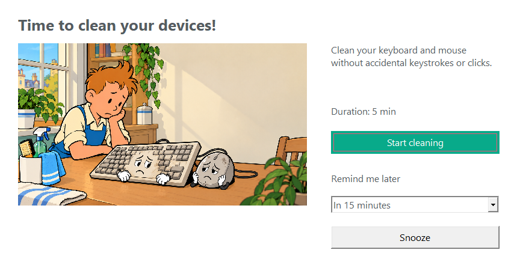
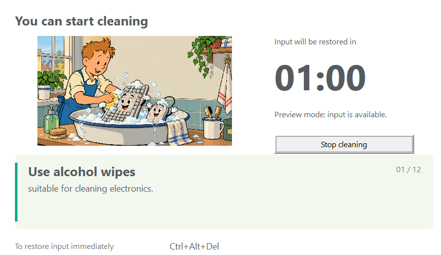
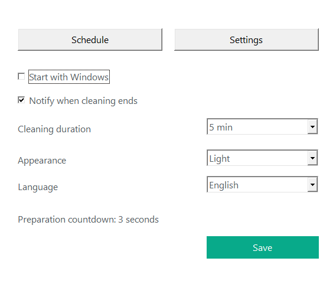
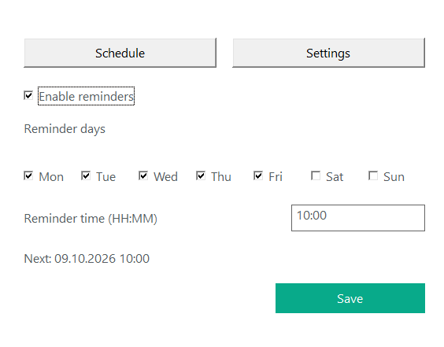

# CleanPause

[English](README.md) · [Русский](README.ru.md)

CleanPause is a Windows tray app that reminds you to clean your keyboard and
mouse and temporarily blocks input while you wipe them. It works locally,
without network access or telemetry.

## Features

- Reminder days selected with weekday checkboxes and a local reminder time.
- Snooze for 15 minutes, 1–3 hours, or the next selected day.
- Start from a reminder with one click and a three-second countdown.
- Cleaning duration of 1–15 minutes; the default is 5 minutes.
- Illustrated reminders and cleaning tips rotating every 6 seconds.
- Russian, English, and automatic Windows profile language selection.
- Tray controls, optional Windows startup, light and dark themes.

## Screenshots

Native UI captures in simulation mode; input remains available.

| Reminder | Cleaning |
|---|---|
|  |  |

| Settings | Schedule |
|---|---|
|  |  |

## Install and use

Build the installer below and run `dist/CleanPause-Setup.exe`. First close
CleanPause using **Exit** in the tray.

Installation is per user into `%LOCALAPPDATA%\CleanPause`, with a Start menu
shortcut, an optional desktop shortcut, and an uninstaller. Settings are preserved
on update and uninstall. Installation does not require administrator privileges;
the application may request UAC elevation for Windows `BlockInput`.

Right-click the tray icon for the menu; double-click to prepare a manual session.
In **Schedule**, select days and a local time, then click **Save**. Saving clears
previous snoozes. Selecting the current minute triggers a reminder on the next
timer tick if today is selected. Reminders never block input without your action.

Save your work before cleaning. The reminder's **Start cleaning** button starts
the countdown directly; you can cancel during the countdown.

**Press Ctrl+Alt+Del to restore input immediately.** Windows releases the block
on this system sequence; CleanPause detects the desktop switch and ends the
session. [Microsoft BlockInput documentation](https://learn.microsoft.com/en-us/windows/win32/api/winuser/nf-winuser-blockinput).

## Language and configuration

Settings → **Language** offers Russian, English, and Windows default. Russian
Windows profiles use Russian; other profiles use English. Manual choices are
stored in `HKCU\Software\CleanPause`, `Language` (`REG_SZ`, `ru` or `en`).
Windows default removes that override.

Settings and logs: `%LOCALAPPDATA%\CleanPause\config.json` and `cleanpause.log`.
Illustrations and instructions are embedded; no external runtime assets are needed.

## Build

Requirements: Windows x64, Go 1.25+, and PowerShell. Native Win32 APIs and the Go
standard library are used, without CGO or external Go modules.

```powershell
git clone https://github.com/admeugene-prog/CleanPause.git
cd CleanPause
.\build.ps1
.\dist\CleanPause.exe

# UI preview without blocking input or requesting elevation
.\dist\CleanPause.exe --simulate-input --show-settings
```

The build generates icon/manifest resources, runs short tests and `go vet`, and
produces `dist/CleanPause.exe`. Generated binaries are excluded from Git.

### Signing and installer

Use your own local certificate; private keys are never included in the repository.
Certificate generation requires OpenSSL.

```powershell
.\tools\New-SigningCertificate.ps1
.\build.ps1 -Sign
.\build-installer.ps1
```

The installer build downloads the official Inno Setup 6.7.3 compiler, verifies its
signature, and uses portable mode. The app, installer, and embedded uninstaller
are signed. [Signing details](signing/README.md) · [Installer details](installer/README.md).

The local CA is self-signed and does not provide public publisher trust. Signing
does not guarantee antivirus acceptance. Symantec has flagged some builds as
`Heur.AdvML.B`; suspected false positives can be submitted to
[Broadcom SymSubmit](https://symsubmit.symantec.com/).

## Verification

```powershell
go test -short ./...
go vet ./...
go test ./...           # Includes a 60-second worker simulation
.\tests\smoke.ps1       # Close CleanPause first
```

A separate worker owns the input block and independent timer. The UI monitors
heartbeat events; the worker watches the parent process. Late events from stopped
sessions are ignored. Tests cover scheduling, settings, IPC, cancellation, and
native reminder window creation. Real blocking, UAC, recovery, and multiple
monitors still require manual validation on target Windows systems.

[Manual tests](tests/MANUAL_TESTS.md) · [Verification results](tests/AUTOMATED_RESULTS.md).

## License

[MIT](LICENSE). Original mockups: `mockups/`. [Original specification](CleanPause_TZ.md).
