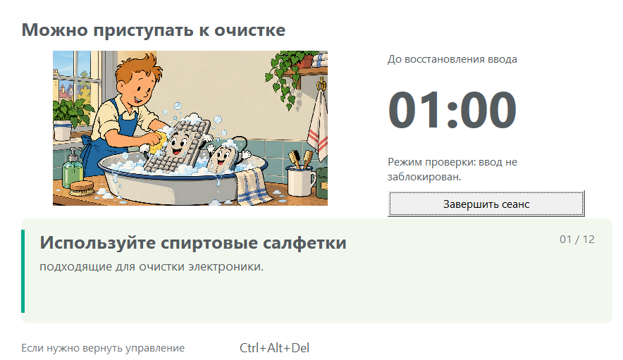
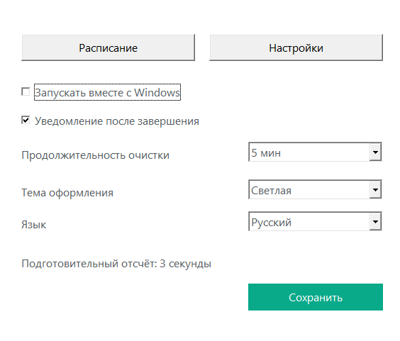
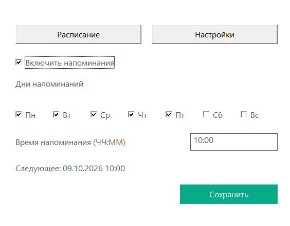

# CleanPause

[English](README.md) · [Русский](README.ru.md)

CleanPause — приложение для Windows, которое напоминает о чистке клавиатуры и
мыши и временно блокирует ввод, пока вы протираете устройства. Работает локально,
без сети и телеметрии.

## Возможности

- Дни напоминаний задаются галочками, время — по местным часам Windows.
- Перенос на 15 минут, 1–3 часа или следующий выбранный день.
- Запуск из напоминания одним нажатием с трёхсекундным отсчётом.
- Очистка от 1 до 15 минут; по умолчанию — 5 минут.
- Иллюстрации и советы, переключающиеся каждые 6 секунд.
- Русский, английский и автоматический язык профиля Windows.
- Работа в трее, автозапуск по настройке, светлая и тёмная темы.

## Скриншоты

Снимки настоящих окон в режиме симуляции — ввод остаётся доступен.

| Напоминание | Очистка |
|---|---|
|  |  |

| Настройки | Расписание |
|---|---|
|  |  |

## Установка и использование

Соберите установщик по инструкции ниже и запустите `dist/CleanPause-Setup.exe`.
Сначала завершите CleanPause через **«Выход»** в трее.

Установка выполняется для текущего пользователя в `%LOCALAPPDATA%\CleanPause`.
Создаются ярлык в меню «Пуск», необязательный ярлык на рабочем столе и запись
удаления. Настройки сохраняются при обновлении и удалении. Установщик не требует
прав администратора; приложение может запросить UAC для Windows `BlockInput`.

Правый щелчок по значку трея открывает меню, двойной — ручную подготовку.
В **«Расписание»** отметьте дни, задайте местное время и нажмите **«Сохранить»**.
Сохранение сбрасывает прежний перенос. При выборе текущей минуты напоминание
появится на следующем тике, если сегодняшний день отмечен. Само напоминание
не блокирует ввод без вашего действия.

Перед очисткой сохраните работу. Кнопка **«Начать очистку»** в напоминании сразу
запускает отсчёт, во время которого доступна отмена.

**Для немедленного восстановления ввода нажмите Ctrl+Alt+Del.** Windows снимает
блокировку при этой последовательности; CleanPause замечает смену рабочего
стола и завершает сеанс. [Документация Microsoft BlockInput](https://learn.microsoft.com/en-us/windows/win32/api/winuser/nf-winuser-blockinput).

## Язык и настройки

В **Настройки → Язык** доступны «Русский», «English» и «Как в Windows».
Для русского профиля Windows используется русский, для остальных — английский.
Ручной выбор сохраняется в `HKCU\Software\CleanPause`, значение `Language`
типа `REG_SZ`: `ru` или `en`. «Как в Windows» удаляет переопределение.

Настройки и журнал: `%LOCALAPPDATA%\CleanPause\config.json` и `cleanpause.log`.
Иллюстрации и инструкции встроены в EXE; отдельные файлы ресурсов не нужны.

## Сборка

Нужны Windows x64, Go 1.25+ и PowerShell. Используются Win32 и стандартная
библиотека Go, без CGO и внешних Go-модулей.

```powershell
git clone https://github.com/admeugene-prog/CleanPause.git
cd CleanPause
.\build.ps1
.\dist\CleanPause.exe

# Проверка интерфейса без блокировки и повышения прав
.\dist\CleanPause.exe --simulate-input --show-settings
```

Сборка создаёт ресурсы иконки и manifest, запускает быстрые тесты и `go vet`,
затем создаёт `dist/CleanPause.exe`. Сгенерированные файлы исключены из Git.

### Подпись и установщик

Для подписи используйте собственный локальный сертификат. Закрытых ключей
в репозитории нет. Для выпуска сертификата нужен OpenSSL.

```powershell
.\tools\New-SigningCertificate.ps1
.\build.ps1 -Sign
.\build-installer.ps1
```

Сборка установщика скачивает официальный Inno Setup 6.7.3, проверяет подпись
компилятора и использует переносной режим. Подписываются приложение, установщик
и встроенный деинсталлятор. [Подпись](signing/README.md) · [Установщик](installer/README.md).

Локальный CA самоподписанный и не даёт публичного доверия издателю. Подпись
не гарантирует отсутствие срабатываний антивируса. Symantec обнаруживал некоторые
сборки как `Heur.AdvML.B`; предполагаемые ложные срабатывания можно отправить
на [проверку Broadcom](https://symsubmit.symantec.com/).

## Проверка

```powershell
go test -short ./...
go vet ./...
go test ./...           # Включает 60-секундную симуляцию worker
.\tests\smoke.ps1       # Сначала закройте CleanPause
```

Отдельный worker устанавливает блокировку и ведёт независимый таймер. Интерфейс
контролирует heartbeat; worker следит за родительским процессом. Поздние события
отменённого сеанса игнорируются. Тесты проверяют расписание, настройки, IPC,
отмену и создание окна напоминания. Реальная блокировка, UAC, восстановление
и несколько мониторов требуют ручной проверки на целевых версиях Windows.

[Ручные испытания](tests/MANUAL_TESTS.md) · [Результаты проверки](tests/AUTOMATED_RESULTS.md).

## Лицензия

[MIT](LICENSE). Исходные макеты — `mockups/`. [Техническое задание](CleanPause_TZ.md).

## Автоматическая сборка

[GitHub Actions](https://github.com/admeugene-prog/CleanPause/actions) проверяет и собирает Windows x64 при изменениях в `main`, pull request и ручном запуске **Run workflow**. В успешном запуске скачайте `CleanPause-windows-x64`; артефакты хранятся 7 дней.

Отправка тега, например `v1.0.1`, автоматически создаёт Release с `CleanPause.exe`, `CleanPause-Setup.exe` и `SHA256SUMS.txt`. Версия установщика берётся из тега; формат тега — `vMAJOR.MINOR.PATCH`.

Файлы CI **не подписаны**. Закрытые сертификаты в GitHub не загружаются. Локальная подписанная сборка: `./build-installer.ps1`. Сборка как в CI: `./build-installer.ps1 -Unsigned -Version 1.0.1`.
